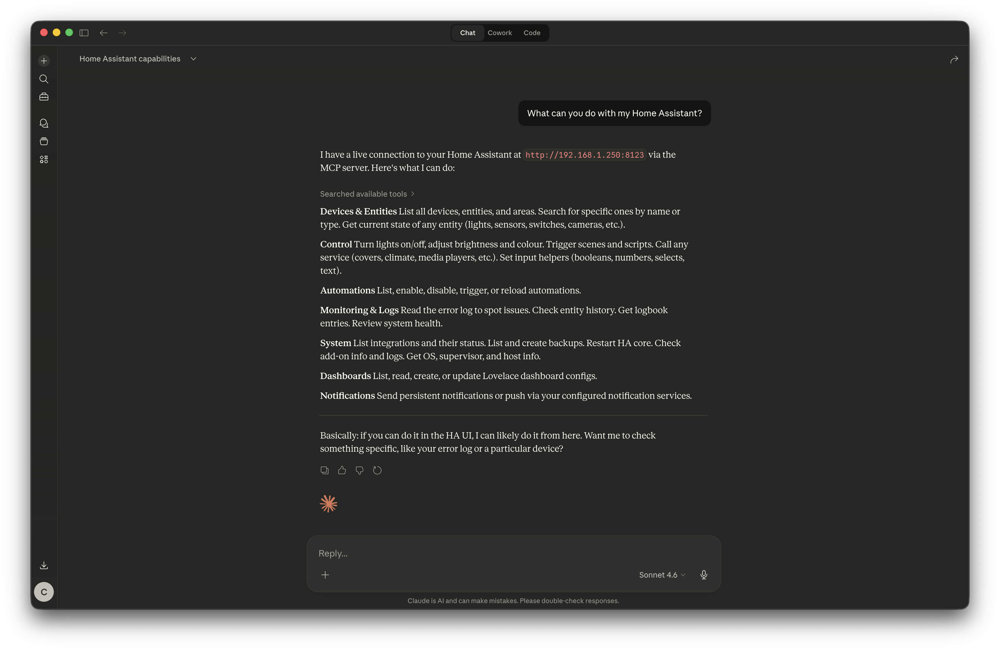

# Home Assistant MCP Server

A [Model Context Protocol (MCP)](https://modelcontextprotocol.io) server for Home Assistant. Control entities, automations, dashboards, add-ons, and system settings from any MCP-compatible LLM client.



## Table of Contents

- [Features](#features)
- [Requirements](#requirements)
- [Installation](#installation)
- [Generating a Long-Lived Access Token](#generating-a-long-lived-access-token)
- [Configuration](#configuration)
- [Running the Server](#running-the-server)
  - [Directly with uv](#directly-with-uv)
  - [With Docker](#with-docker)
  - [With Podman](#with-podman)
- [Connecting to Claude Desktop](#connecting-to-claude-desktop)
- [Connecting to Claude Code](#connecting-to-claude-code)
- [Available Tools](#available-tools)
  - [Entities & Services](#entities--services)
  - [Dashboards (Lovelace)](#dashboards-lovelace)
  - [Add-ons (Supervisor only)](#add-ons-supervisor-only)
  - [Logs](#logs)
  - [Automations, Scripts & Scenes](#automations-scripts--scenes)
  - [System & Configuration](#system--configuration)
  - [Notifications](#notifications)
  - [Input Helpers & Timers](#input-helpers--timers)
  - [Device & Integration Registry](#device--integration-registry)
- [Notes on Supervisor Tools](#notes-on-supervisor-tools)
- [Development](#development)
- [License](#license)

---

## Features

| Category | Tools |
|---|---|
| Entities & Devices | List, get, set state, call services, search, areas, devices, history, logbook, templates, events |
| Dashboards | List, get config, create, update, delete Lovelace dashboards |
| Add-ons | List, install, uninstall, update, start, stop, restart, configure, manage repositories |
| Logs | Error log, Supervisor logs, Core logs, Host logs, add-on logs |
| Automations | List, trigger, enable, disable, and reload automations. Run scripts and activate scenes |
| System | HA config, validate config, restart, integrations, health, users, backups, OS/Core/Supervisor updates |
| Notifications | Send notifications via any notify service, manage persistent UI notifications |
| Input Helpers & Timers | Set input_boolean, input_number, input_select, input_text, input_datetime, and timer entities |
| Device & Integration Registry | Browse device hardware info, list config entries, reload integrations |

**78 tools** in total.

---

## Requirements

- **Python 3.14+**
- **[uv](https://docs.astral.sh/uv/)**: Python package and environment manager
- A running **Home Assistant** instance reachable over the network
- A **long-lived access token** from your HA profile (see below)

> Supervisor-based tools (add-ons, OS updates, backups) require a **Home Assistant OS** or **Supervised** installation. They will return errors on plain Docker/Core setups.

---

## Installation

```bash
git clone https://github.com/but3k4/ha-mcp-server.git
cd ha-mcp-server

# Create the virtual environment and install dependencies
uv sync
```

---

## Generating a Long-Lived Access Token

1. Open your Home Assistant instance in a browser.
2. Click your **profile avatar** in the bottom-left corner (or go to `http://<your-ha-url>/profile`).
3. Click on the **Security** tab.
4. Scroll to the **Long-Lived Access Tokens** section at the bottom of the page.
5. Click **Create Token**.
6. Give it a name (e.g. `mcp-server`) and click **OK**.
7. **Copy the token immediately.** It will not be shown again.

> Keep this token secret. It grants full API access to your Home Assistant instance.

---

## Configuration

Copy the example environment file and fill in your values:

```bash
cp .env.example .env
```

Edit `.env`:

```dotenv
# Base URL of your Home Assistant instance (no trailing slash)
HA_URL=http://homeassistant.local:8123

# Long-lived access token generated in your HA profile
HA_TOKEN=your_long_lived_access_token_here
```

Common `HA_URL` formats:

| Setup | URL |
|---|---|
| Local network (default hostname) | `http://homeassistant.local:8123` |
| Local network (IP address) | `http://192.168.1.100:8123` |
| Nabu Casa / Remote UI | `https://abc123.ui.nabu.casa` |
| Custom domain with SSL | `https://ha.yourdomain.com` |

---

## Running the Server

### Directly with uv

```bash
uv run ha-mcp
```

The server communicates over **stdio** and is meant to be launched by an MCP client (like Claude Code), not run manually in a terminal for day-to-day use. Running it directly will start it and wait for JSON-RPC input.

To verify the setup is working:

```bash
uv run python -c "from ha_mcp.server import create_server; print('OK')"
```

---

### With Docker

**Build the image:**

```bash
docker build -t ha-mcp-server .
```

The included `Dockerfile`:

```dockerfile
FROM python:3.14-slim

WORKDIR /app

COPY --from=ghcr.io/astral-sh/uv:latest /uv /usr/local/bin/uv

COPY pyproject.toml uv.lock ./
RUN uv sync --frozen --no-dev

COPY ha_mcp/ ./ha_mcp/

CMD ["uv", "run", "ha-mcp"]
```

**Run the container:**

```bash
docker run --rm -i \
  -e HA_URL=http://homeassistant.local:8123 \
  -e HA_TOKEN=your_token_here \
  ha-mcp-server
```

> The `-i` flag keeps stdin open, which is required for stdio MCP transport.

**Using an env file:**

```bash
docker run --rm -i --env-file .env ha-mcp-server
```

**For Claude Code integration**, the Docker command goes into your MCP config (see [Connecting to Claude Code](#connecting-to-claude-code)).

---

### With Podman

Podman is a drop-in Docker alternative that runs rootless by default.

**Build the image:**

```bash
podman build -t ha-mcp-server .
```

**Run the container:**

```bash
podman run --rm -i \
  -e HA_URL=http://homeassistant.local:8123 \
  -e HA_TOKEN=your_token_here \
  ha-mcp-server
```

**Using an env file:**

```bash
podman run --rm -i --env-file .env ha-mcp-server
```

**Rootless networking note:** If your Home Assistant is on the local network and you are running Podman rootless, you may need to use `--network=host` so the container can reach `homeassistant.local`:

```bash
podman run --rm -i --network=host --env-file .env ha-mcp-server
```

---

## Connecting to Claude Desktop

1. Open Claude Desktop.
2. Click the **hamburger menu** (≡) in the top-left corner.
3. Go to **Settings** → **Developer** tab.
4. Click **Edit Config**. This opens `claude_desktop_config.json` in your text editor.
5. Add the `mcpServers` block to the existing JSON (merge it, do not create a second `{}`):

```json
{
  "mcpServers": {
    "home-assistant": {
      "command": "uv",
      "args": [
        "run",
        "--project", "/absolute/path/to/ha-mcp-server",
        "ha-mcp"
      ]
    }
  }
}
```

> The `.env` file in the project directory is picked up automatically, so there is no need to repeat credentials here.

6. Save the file and **fully quit and relaunch** Claude Desktop.
7. A hammer icon near the message input confirms the tools are loaded.

---

## Connecting to Claude Code

Add the server to your Claude Code MCP configuration. The config file location depends on the scope you want:

| Scope | File |
|---|---|
| Current project only | `.claude/claude_desktop_config.json` (in project root) |
| All projects for your user | `~/.claude/claude_desktop_config.json` |

### Option 1: Run directly with uv (recommended for local dev)

```json
{
  "mcpServers": {
    "home-assistant": {
      "command": "uv",
      "args": [
        "run",
        "--project", "/absolute/path/to/ha-mcp-server",
        "ha-mcp"
      ],
      "env": {
        "HA_URL": "http://homeassistant.local:8123",
        "HA_TOKEN": "your_token_here"
      }
    }
  }
}
```

> Alternatively, omit the `env` block and use a `.env` file in the project directory instead.

### Option 2: Run with Docker

```json
{
  "mcpServers": {
    "home-assistant": {
      "command": "docker",
      "args": [
        "run", "--rm", "-i",
        "-e", "HA_URL=http://homeassistant.local:8123",
        "-e", "HA_TOKEN=your_token_here",
        "ha-mcp-server"
      ]
    }
  }
}
```

### Option 3: Run with Podman

```json
{
  "mcpServers": {
    "home-assistant": {
      "command": "podman",
      "args": [
        "run", "--rm", "-i",
        "--network=host",
        "-e", "HA_URL=http://homeassistant.local:8123",
        "-e", "HA_TOKEN=your_token_here",
        "ha-mcp-server"
      ]
    }
  }
}
```

After editing the config, restart Claude Code or run `/mcp` to reload servers.

---

## Available Tools

### Entities & Services

| Tool | Description |
|---|---|
| `list_entities` | List all entities, optionally filtered by domain (e.g. `light`, `sensor`) |
| `get_entity` | Get the current state and attributes of a single entity |
| `set_entity_state` | Directly write state to the HA state machine (use for virtual/input entities) |
| `call_service` | Call any HA service. This is the primary way to control physical devices |
| `search_entities` | Search entities by ID, friendly name, or state |
| `list_services` | List all available services grouped by domain |
| `list_areas` | List all configured areas |
| `list_devices` | List all entities with their friendly names and area assignments |
| `list_entity_registry` | List entities assigned to an area, with friendly names and area info |
| `get_entity_history` | Get historical state changes for an entity over a time range |
| `get_logbook` | Fetch logbook entries, optionally filtered by entity and time |
| `render_template` | Render a Jinja2 template using HA's template engine |
| `fire_event` | Fire a custom event on the HA event bus |

### Dashboards (Lovelace)

| Tool | Description |
|---|---|
| `list_dashboards` | List all configured Lovelace dashboards |
| `get_dashboard_config` | Get the full YAML/JSON config for a dashboard |
| `create_dashboard` | Create a new Lovelace dashboard |
| `update_dashboard` | Update metadata (title, icon, sidebar visibility) for an existing dashboard |
| `update_dashboard_config` | Replace the full configuration of a dashboard |
| `delete_dashboard` | Delete a dashboard by its internal ID |

### Add-ons (Supervisor only)

| Tool | Description |
|---|---|
| `list_addons` | List all available and installed add-ons |
| `get_addon_info` | Get detailed info for a specific add-on |
| `install_addon` | Install an add-on from the store |
| `uninstall_addon` | Remove an installed add-on |
| `update_addon` | Update an add-on to the latest version |
| `start_addon` | Start a stopped add-on |
| `stop_addon` | Stop a running add-on |
| `restart_addon` | Restart an add-on |
| `get_addon_logs` | Fetch stdout/stderr logs for an add-on |
| `set_addon_options` | Update configuration options for an add-on |
| `list_addon_repositories` | List configured add-on repositories |
| `add_addon_repository` | Add a third-party add-on repository by Git URL |

### Logs

| Tool | Description |
|---|---|
| `get_error_log` | Get the HA Core error log |
| `get_supervisor_logs` | Get Supervisor process logs |
| `get_core_logs` | Get Core process logs via Supervisor |
| `get_host_logs` | Get host OS / journald logs |
| `get_multicast_logs` | Get Multicast service logs |

### Automations, Scripts & Scenes

| Tool | Description |
|---|---|
| `list_automations` | List all automations |
| `trigger_automation` | Manually trigger an automation |
| `enable_automation` | Enable a disabled automation |
| `disable_automation` | Disable an automation |
| `reload_automations` | Reload automations from YAML without restarting |
| `list_scripts` | List all scripts |
| `run_script` | Execute a script entity, optionally with variables |
| `list_scenes` | List all scenes |
| `activate_scene` | Activate a scene |

### System & Configuration

| Tool | Description |
|---|---|
| `get_ha_config` | Get HA core configuration (version, location, units, etc.) |
| `check_config` | Validate YAML configuration files |
| `restart_ha` | Restart the Home Assistant Core process |
| `get_supervisor_info` | Get Supervisor version and update status |
| `get_core_info` | Get Core process info via Supervisor |
| `get_host_info` | Get host OS info (CPU, memory, hostname) |
| `get_os_info` | Get HA OS version and update status |
| `update_core` | Update HA Core to the latest version |
| `update_supervisor` | Update the Supervisor |
| `update_os` | Update the HA OS |
| `list_integrations` | List all installed integration config entries |
| `reload_integration` | Reload a specific integration without restarting |
| `get_system_health` | Get health status for all components |
| `list_users` | List all HA user accounts |
| `create_backup` | Trigger a full system backup |
| `list_backups` | List all available backups |

### Notifications

| Tool | Description |
|---|---|
| `list_notification_services` | List available notify service names (e.g. `notify`, `mobile_app_my_phone`) |
| `send_notification` | Send a notification via any notify service, with optional title, target, and extra data |
| `list_persistent_notifications` | List active persistent notifications in the HA UI bell menu |
| `create_persistent_notification` | Create a persistent notification (Markdown supported. Optional stable ID for upsert) |
| `dismiss_persistent_notification` | Dismiss a persistent notification by its notification ID |

### Input Helpers & Timers

| Tool | Description |
|---|---|
| `list_input_helpers` | List all helper and timer entities, optionally filtered by domain |
| `set_input_boolean` | Turn an `input_boolean` helper on or off |
| `set_input_number` | Set the numeric value of an `input_number` helper |
| `set_input_select` | Select an option on an `input_select` helper |
| `set_input_text` | Set the text value of an `input_text` helper |
| `set_input_datetime` | Set date, time, or combined datetime on an `input_datetime` helper |
| `start_timer` | Start or restart a `timer` entity, with optional duration override |
| `pause_timer` | Pause a running `timer`, preserving the remaining time |
| `cancel_timer` | Cancel a `timer` without firing the `timer.finished` event |

### Device & Integration Registry

| Tool | Description |
|---|---|
| `get_device_registry` | List physical devices with manufacturer, model, firmware, and area assignments |
| `list_config_entries` | List all loaded integration config entries with `entry_id`, domain, title, and state |
| `reload_config_entry` | Reload a single integration by `entry_id` without restarting HA |

---

## Notes on Supervisor Tools

Tools in the **Add-ons**, **Logs** (except `get_error_log`), and **System** (update/backup) categories use the Supervisor API (`/api/hassio/`). These are only available on:

- **Home Assistant OS** (the recommended full installation on a dedicated device)
- **Home Assistant Supervised** (manual installation on a generic Linux system)

They will return a `HomeAssistantError` on:

- **Home Assistant Container** (plain Docker image, no Supervisor)
- **Home Assistant Core** (bare Python installation)

If you are on Container or Core, the entity, service, dashboard, automation, and configuration tools will still work normally.

---

## Development

### Setting up the environment

```bash
git clone https://github.com/but3k4/ha-mcp-server.git
cd ha-mcp-server

# Create the virtual environment and install all dependencies (including dev)
uv sync --all-groups
```

This creates a `.venv` directory and installs both runtime and development dependencies (including `ruff`).

### Linting and formatting

[Ruff](https://docs.astral.sh/ruff/) is used for both linting and formatting. Run it before making changes to establish a clean baseline, and again after your changes before committing:

```bash
# Check for lint errors
uv run ruff check .

# Auto-fix lint errors where possible
uv run ruff check --fix .

# Format code
uv run ruff format .
```

> Always run `ruff check` and `ruff format` before and after every change. Do not commit code with ruff errors.

### Type checking

[mypy](https://mypy.readthedocs.io) is used for static type checking. Run it alongside ruff:

```bash
uv run mypy .
```

> All function signatures must have type hints. Do not commit code with mypy errors.

---

## License

This project is licensed under the [MIT License](LICENSE).
